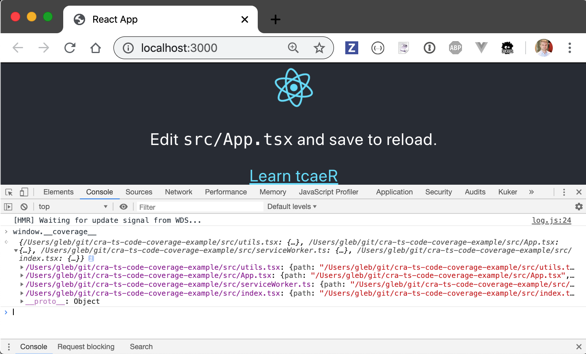
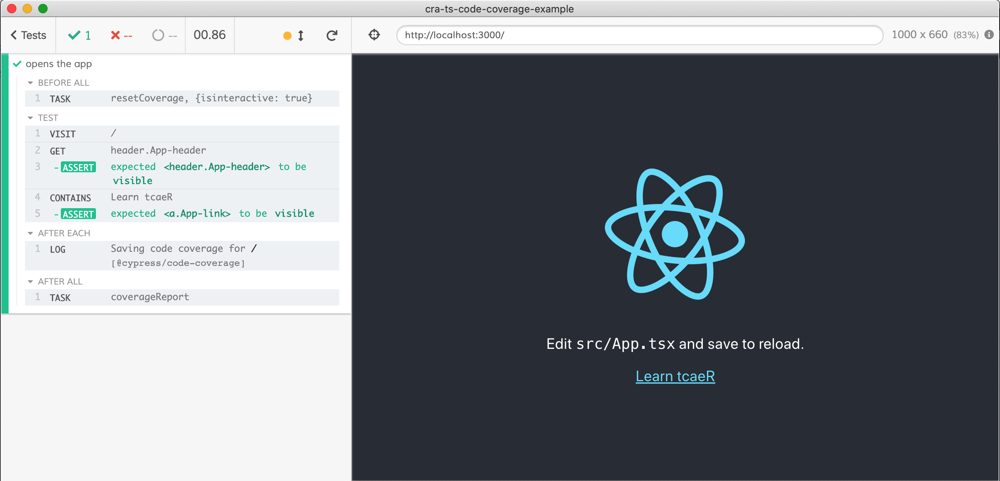
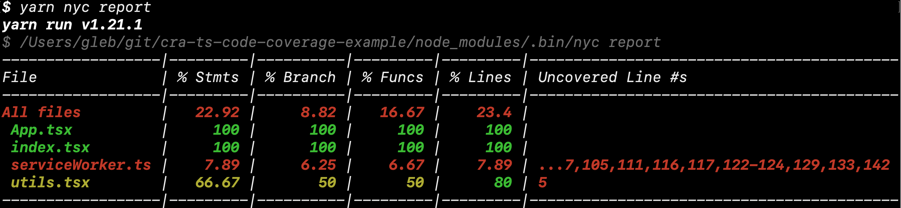
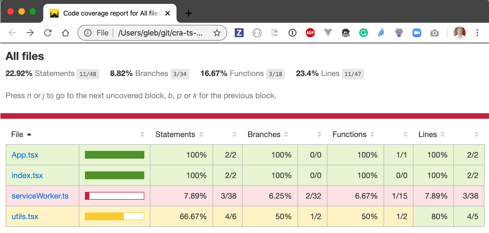
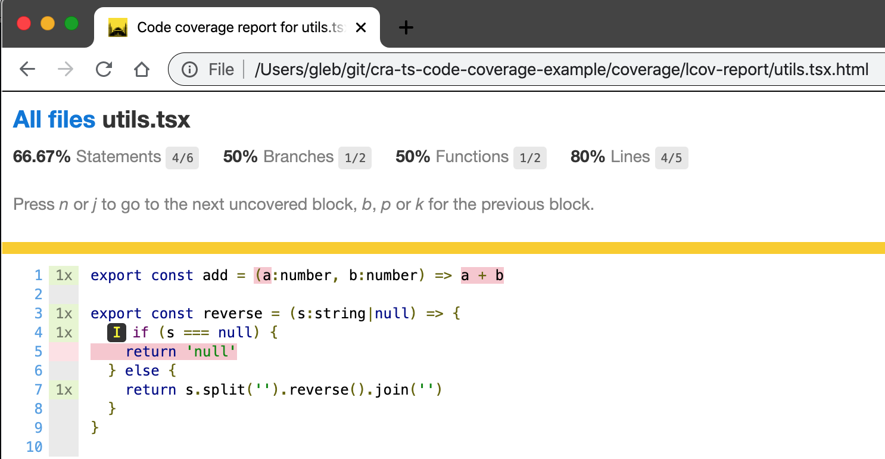

# cra-ts-code-coverage-example [![renovate-app badge][renovate-badge]][renovate-app] [](.github/workflows/test.yml)
> React App with TypeScript and Cypress code coverage

This project was created using CRA v3

```shell
$ npm i -g create-react-app
+ create-react-app@3.3.1
$ create-react-app cra-ts-code-coverage-example --typescript
```

## Current dependencies

Name | Description
--- | ---
 | Cypress test runner [cypress-io/cypress](https://github.com/cypress-io/cypress)
 | Instruments `react-scripts` applications on the fly
 | Generates coverage reports after Cypress test runs


## Cypress tests with code coverage

Add Cypress and code coverage report plugin

```shell
$ yarn add -D cypress @cypress/code-coverage
info Direct dependencies
├─ @cypress/code-coverage@3.7.2
└─ cypress@4.5.0
```

Add library to instrument application code on the fly

```shell
$ yarn add -D @cypress/instrument-cra
info Direct dependencies
└─ @cypress/instrument-cra@1.1.0
```

Change the `start` script in [package.json](package.json) to be `react-scripts -r @cypress/instrument-cra start`. If you start application now, there should be object `window.__coverage__` with code coverage numbers.



Watch video [How to instrument react-scripts web application for code coverage](https://youtu.be/edgeQZ8UpD0)

### Set up coverage plugin

In [cypress/support/index.js](cypress/support/index.js) add line

```js
import '@cypress/code-coverage/support'
```

In [cypress/plugins/index.js](cypress/plugins/index.js) log the coverage plugin

```js
module.exports = (on, config) => {
  require('@cypress/code-coverage/task')(on, config)
  // IMPORTANT to return the config object
  // with the any changed environment variables
  return config
}
```

Hint: check [cypress-io/code-coverage](https://github.com/cypress-io/code-coverage) README for current installation instructions.

Watch video [Get code coverage reports from Cypress tests](https://youtu.be/y8StkffYra0)

### Run tests

Start app and Cypress

```shell
$ yarn add -D start-server-and-test
info Direct dependencies
└─ start-server-and-test@1.10.8
```

In [package.json](package.json)

```json
{
  "scripts": {
    "start": "react-scripts -r @cypress/instrument-cra start",
    "cy:open": "cypress open",
    "dev": "start-test 3000 cy:open"
  }
}
```

Tip: watch video [Using start-server-and-test to start app, run tests and shut everything down](https://youtu.be/mYXXSvcmQ6Y)

Start Cypress with `npm run dev` and run a single end-to-end test [cypress/integration/spec.js](cypress/integration/spec.js)

```js
it('opens the app', () => {
  cy.visit('/')
  cy.get('header.App-header').should('be.visible')
  cy.contains('Learn tcaeR').should('be.visible')
})
```



The code coverage information is saved automatically in the folder `.nyc_output`. Run `nyc` tool to see summary in the terminal

```shell
$ yarn nyc report
```



Or open generated static code coverage report with `open coverage/lcov-report/index.html`



You can drill into individual files



You can see the app has never called `add(a, b)` function, and only has called the `reverse(s)` function once passing a string.

## See also

For more examples, see [cypress-io/code-coverage](https://github.com/cypress-io/code-coverage#examples) and read the Cypress [Code Coverage Guide](http://on.cypress.io/code-coverage). You can also watch [Cypress.io - State of the Art Testing Tool](https://www.youtube.com/watch?v=JL3QKQO80fs) presentation and see its [slides](https://slides.com/bahmutov/state-of-the-art).

Watch series of short videos [Cypress tips & tricks](https://www.youtube.com/playlist?list=PLP9o9QNnQuAYYRpJzDNWpeuOVTwxmIxcI)

[renovate-badge]: https://img.shields.io/badge/renovate-app-blue.svg
[renovate-app]: https://renovateapp.com/
